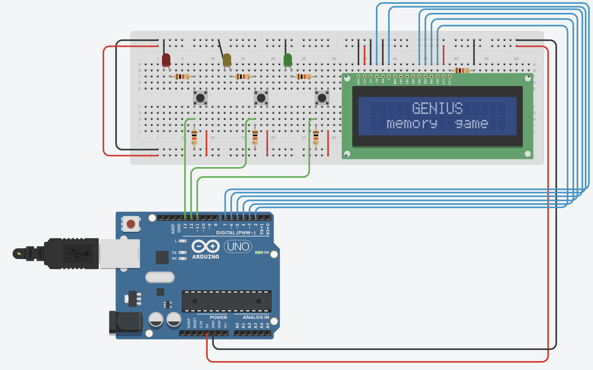

# arduino-genius-game

## Description

This is an arduino project done in C++ to create a Genius style memory game.

## Setup

The basic components would be:

- An arduino (Yún, Uno, etc)
- A breadboard
- A 16x2 LCD screen
- 18 wires (for LCD, 5V and ground)
- 1 resistor (for LCD)

After that, notice from the image above that the structure between columns 2 and 9, composed by:

- 1 LED
- 2 Resistors
- 1 Button
- 3 wires

is basically repeated 3 times. You can repeat this structure as many times as you want in order to add more playable options for the user. In this example, we have 3 (red, yellow and green).

## Build

Start your Arduino IDE. Customize `game.ino` lines 18 and 19 with the appropriate pin numbers you used in your board. If you need to test your wire connections first, you can use `test.ino` (customie lines 10 and 11 with the appropriate pin numbers in your board). Upload the file and play the game.